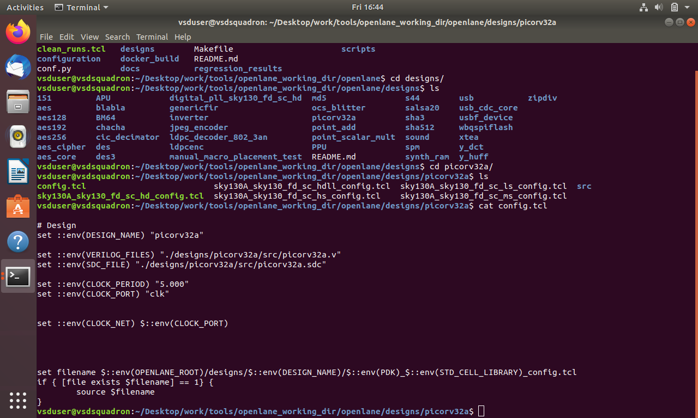

# OpenSOC

### Initial Setup

**Oracle VirtualBox**
After installing and launching `virtualbox` from the terminal, the following screen confirms successful setup:


**VM Desktop View**
This is the virtual machine's desktop environment after loading the VDI. The EDA tools and directories will be accessed from here.


---

## Day 1: Sky130 – Inception of Open-Source EDA, OpenLANE, and Sky130 PDK

<details>
  <summary><strong>SKY130_D1_SK1 - How to Talk to Computers</strong></summary>

<br>

This section introduces the basics of computer interaction, emphasizing the flow of information between hardware and software. It also lays the foundation for understanding digital logic and system-level communication.

* 
* 
* 

</details>

<details>
  <summary><strong>SKY130_D1_SK2 - SoC Design and OpenLANE</strong></summary>

<br>

This part explains the concept of System-on-Chip (SoC) design and introduces the OpenLANE toolchain. It covers how various stages like synthesis, floorplanning, placement, and routing are handled by open-source tools.

* 
* 
* 
* 

</details>

---

### SKY130\_D1\_SK3 - Get Familiar with Open-Source EDA Tools

This section involves hands-on interaction with the OpenLANE flow and Sky130 PDK using a Docker-based environment. The goal is to prepare, synthesize, and analyze a small RISC-V based SoC core design called `picorv32a`.

---

**1. OpenLANE Directory Structure**

The directory structure includes tool binaries, PDK files, and a working area for designs. This layout is critical to maintain modularity and separation between various project components.


---

**2. Launching OpenLANE in Docker**

Start by navigating to the OpenLANE working directory and launching the interactive environment using Docker:

```bash
cd Desktop/work/tools/openlane_working_dir/openlane/
docker
flow.tcl -interactive
```

This prepares the environment for interactive command usage through the `flow.tcl` script.


---

**3. Design Preparation**

Once inside the interactive environment, run the preparation script:

```tcl
prep -design picorv32a
```

This command initializes the design, generates config files like `config.tcl`, and copies necessary technology and design files into the working directory.

* Preparing the design:
  

* Files generated after preparation:
  

* Key configuration and script files, including `config.tcl`:
  

---

**4. Running Synthesis**

After preparation, the synthesis process is triggered using:

```tcl
run_synthesis
```

This step invokes Yosys to generate the synthesized gate-level netlist for the `picorv32a` design.

* Terminal output confirming synthesis:
  

* Breakdown of D flip-flop (`DFF`) cells and total cell count:
  

* Yosys synthesis statistics report:
  

---

### Flop Ratio Calculation

After synthesis, OpenLANE reports a summary of standard cells used. Among these, **D flip-flops (DFFs)** play a crucial role in sequential logic design. The **flop ratio** helps us understand the proportion of sequential elements compared to the total logic.

> **Flop ratio** gives an indication of how sequential the design is. A higher flop ratio typically suggests the design has more registers and thus may be more pipelined or state-driven.

Given:

* DFF cell count (`sky130_fd_sc_hd__dfxtp_2`) = 1613
* Total standard cell count = 14876

**Formula:**

```
Flop Ratio = DFF Count / Total Cells  
           = 1613 / 14876  
           ≈ 0.10842 → 10.84%
```

This value means about **10.84%** of the logic elements in this design are D flip-flops, which is a moderate value for a small RISC-V core like `picorv32a`.

